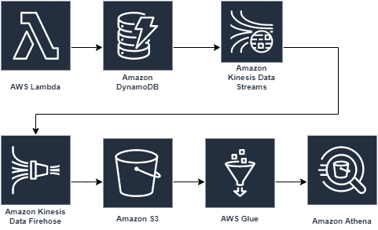

# test-aws-dynamodb-athena-tf

## desription

see more information here: https://dev.to/aws-builders/example-how-to-analyze-dynamodb-item-changes-with-kinesis-and-athena-created-with-terraform-g2h

## warnings

:warning: Don't forget to destroy after testing. Kinesis Data Streams has [costs](https://aws.amazon.com/kinesis/data-streams/pricing/) per hour

## serverless.tf

 The [lambdas](./terraform/lambda.tf) are created with a module from [https://serverless.tf/](https://serverless.tf/)

 Docs: https://github.com/terraform-aws-modules/terraform-aws-lambda

 Examples: https://github.com/terraform-aws-modules/terraform-aws-lambda/tree/master/examples

 See more for serverless here [https://serverless.tf/#aws-serverless](https://serverless.tf/#aws-serverless)
